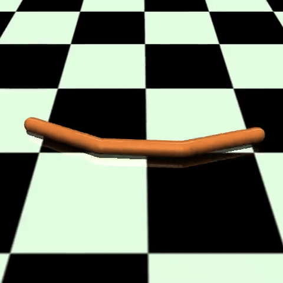
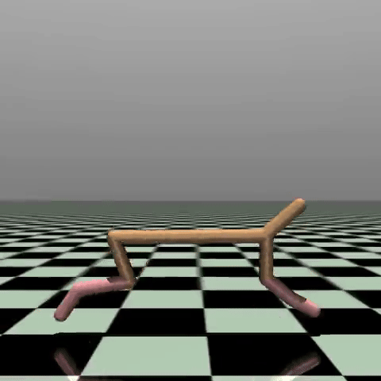

## Reinforcement learning for robotics and complex simulated environments
This repository contains implementation of my Diploma thesis focused on Deep Reinforcement Learning. So far, it is still
heavily work in progress, but there are some parts already done. The environments I want to solve are mainly from robotics
domain; though there might be some other simulated environments as well, if there is enough time and computational resources ;)

### Implemented algorithms:
All the implementations are self-contained, meaning that the logic -- optimization methods, training loops, 
neural networks, etc. -- are kept in a single directory that corresponds to each algorithm. The only code shared amongst 
the algorithms is for saving data, logging (Weights & Biases) and environment control (Gymnasium). This keeps the implementations
more clear, for a price of very slight redundancy.

- [x] Proximal Policy Optimization (PPO)
- [x] Soft Actor-Critic (SAC)
- [x] Twin Delayed Deep Deterministic Policy Gradient (TD3)

### Environments to solve:
- [ ] MuJoCo
  - [x] Swimmer-v5
  - [x] Hopper-v5  
  - [x] HalfCheetah-v5
  - [ ] Walker2D-v5
  - [ ] Ant-v5

### Trained models:
I already trained some models. So far, they are stored in ```models``` folder. Will be changed soon, hopefully.

### Training logs and videos:
Training logs and videos are be stored on Weights & Biases, later on Streamlit presentation page. For now, they remain
private.

### Training and testing agents
Both scripts must be run from Root Directory -- if they are not, the paths and imports might be broken.

Training: ```python -m src.main```

Testing: ```python -m src.playground```

### Dependencies
The code is written in Python 3.11. All major dependencies are listed in requirements.txt. They can be installed
via this command:

Install all dependencies: ```pip install -r requirements.txt```

### Code quality
For formatting and linting, black and pylint are used. Black sometimes loves to produce a bit weird looking code,
but it is a standard in Python ecosystem, so the code looks weird pretty much everywhere ;) The code quality is checked
with every commit using GitHub Actions.

Format source code: ```black src```

Run linter: ```pylint src```

### Random gifs
... because looking at images is more interesting than reading text.




